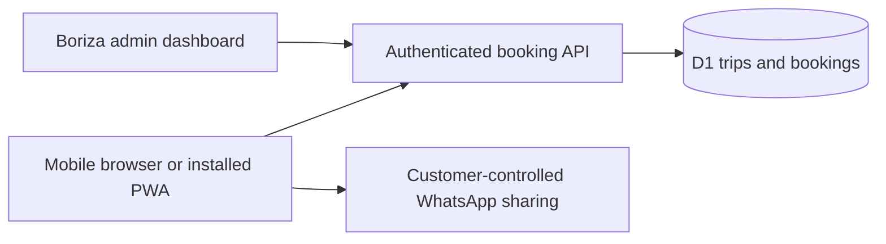

# Borizago — Book. Ride. Explore.

An installable mobile booking website for **Boriza Shuttle & Tours**, Namibia.

Borizago brings scheduled shuttle booking into one simple journey, connecting Windhoek, Swakopmund and Walvis Bay. The product is designed for clients who receive a link on WhatsApp and want to book quickly, without downloading an app-store package.

## Product decision

A progressive web app serves both the browser and phone home screen. One booking service keeps seats, fares and payment status consistent. A lightweight companion website provides a public front door and WhatsApp contact.

## V1 journey

1. Choose departure, destination and date.
2. Select an available trip with live seats and fares.
3. Add named Adult, Pensioner, Student and Child passengers.
4. Provide contact and pickup details; open WhatsApp to send a location pin.
5. Review the server-calculated total and choose EFT or office payment.
6. Sign in, confirm, receive a booking reference and share the booking.

The current sign-in option is ChatGPT. Public browsing is anonymous; personal bookings and administration require sign-in. Publishing real schedules remains an operator task.

## Design

Blue-and-white branding follows the operator’s supplied logo. The mobile home screen exposes the booking controls immediately. A persistent bottom navigation connects booking, history and WhatsApp help. Accessible form labels, visible focus states, clear errors and responsive layouts support use on small screens.

## Engineering

React and TypeScript provide the interface. A server-side API runs on Cloudflare Workers with D1 persistence. Booking and capacity validation happen together in one database statement. Idempotency keys prevent repeated taps from creating duplicate bookings, and version checks reject stale edits. All money is stored in integer cents; the browser cannot choose the total.

Payment-pending bookings consume seats. Cancellation releases them. Staff can change fares and schedules without rebuilding the site. Customer history is restricted to its owner, and admin actions require an explicit server-side allowlist.

## Offline behavior

The app shows a clear offline page. It never pretends to reserve seats without a server response and never caches customer bookings or stale availability.

## Verification

Local integration checks cover eight concurrent requests for three seats, repeated submissions, server-side pricing, cancellation, stale trip revisions, capacity edits and unauthorized writes. These checks use local-only demonstration records.

## Intentionally outside V1

Tours, airport transfers, private transfers, parcels, live tracking, card payments and automatic messaging. The data structure allows later services to be introduced independently.

## Project boundaries

This public repository contains case-study material only. Application source is maintained privately. It contains no passenger data, credentials, bank account details or production database exports. Brand assets belong to Boriza Shuttle & Tours.
