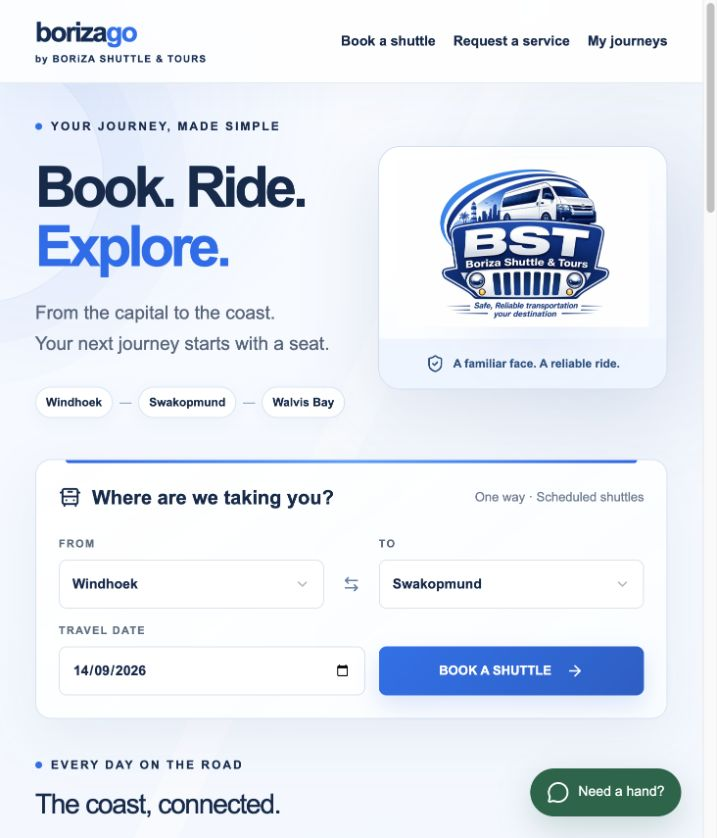
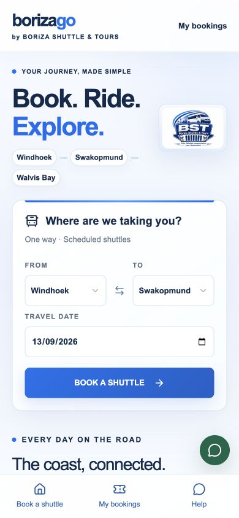
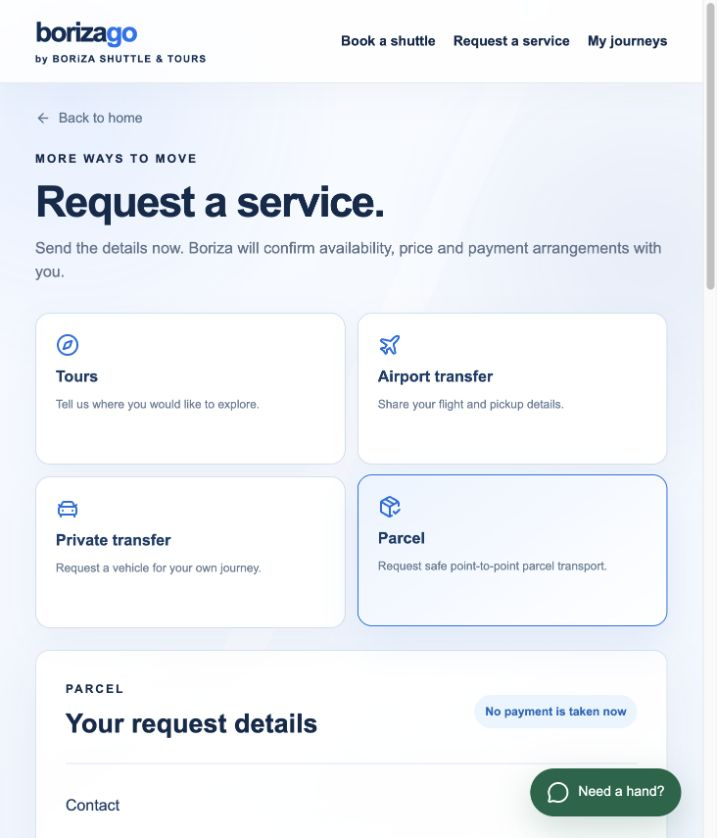
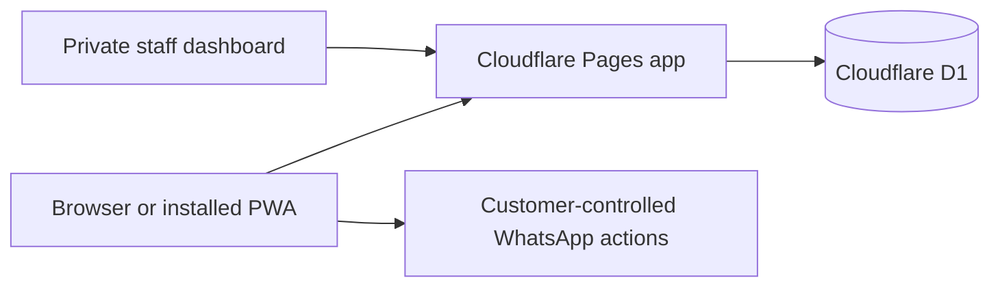

# Borizago — Book. Ride. Explore.

An installable shuttle-booking web app for **Boriza Shuttle & Tours** in Namibia.

[**Open the live app →**](https://borizashuttles.pages.dev/)

  

## The product

Borizago turns a WhatsApp-led booking process into a fast, guided journey that works in a browser and installs directly to a phone home screen. Customers can travel between Windhoek, Okahandja, Karibib, Usakos, Arandis, Swakopmund and Walvis Bay without downloading an app-store package.

The responsive website and installed progressive web app share one Cloudflare-hosted booking system, so seat counts, fares, schedules and payment state stay consistent everywhere.

On phones, the header keeps the Borizago wordmark and a compact **Request service** action visible without crowding the viewport, while the persistent bottom navigation provides direct access to shuttles, services, journeys and help.

## Customer journey

1. Choose the departure town, destination and date.
2. Select a published trip with live seat availability and passenger fares.
3. Add named Adult, Pensioner, Student and Child passengers.
4. Choose a configured pickup and drop-off point, then provide contact details.
5. Review the route, passengers, both locations, server-calculated total and cancellation policy.
6. Confirm the details and actively accept the Terms & Conditions, including luggage, safety and no-refund safeguards.
7. Choose EFT or office payment, confirm the booking and receive a unique reference.
8. Share the confirmation through WhatsApp and revisit it under **My journeys**.

Customers can also request tours, airport transfers, private transfers and parcel transport. Those forms capture the journey, contact, luggage, flight or recipient details Boriza needs for a personal quote.

The installed app detects standalone mode and removes its own install prompt. The booking flow uses a private first-party customer identifier, with no dependency on ChatGPT authentication or hosting.

## Support and travel resources

The public [Help & FAQ](https://borizashuttles.pages.dev/help) explains booking, payment, changes, service requests and pickup/drop-off points in plain language. WhatsApp help is available throughout the journey at **+264 85 772 4329**, with **+264 81 731 4947** available for calls. The footer and home support panel also connect customers to [Boriza on Facebook](https://www.facebook.com/share/14qinXBbi7H/).

Customers can keep the [payment notice](https://borizashuttles.pages.dev/payment-notice.jpeg), [bus-rules poster](https://borizashuttles.pages.dev/bus-rules.jpeg), [daily shuttle fare guide](https://borizashuttles.pages.dev/boriza-daily-shuttle-fares.jpeg), [parcel policy](https://borizashuttles.pages.dev/boriza-parcel-policy.jpeg), [Hosea Kutako–Windhoek transfer guide](https://borizashuttles.pages.dev/boriza-airport-windhoek-transfer.jpeg) and [Hosea Kutako–coast transfer guide](https://borizashuttles.pages.dev/boriza-airport-coast-transfer.jpeg) on their phone. Every poster opens at its natural proportions and can be downloaded directly. The booking flow explains EFT, wallet proof-of-payment and office payment, while the safety and parcel notices cover the practical onboard, luggage, cutoff and restricted-item guidance.

The airport request screen presents the advertised N$400 per-person or N$2,000 group Windhoek transfer and the N$7,000 group coast transfer, with Boriza confirming final availability, pickup area and price. The parcel screen presents the 08:00–11:00 same-day cutoff, next-day handling after the cutoff, expected arrival window and starting rates. The daily shuttle poster is clearly treated as an advertised fare guide; admin-managed trips remain the source of truth for live departure times, capacity and bookable fares.

The review screen requires two deliberate confirmations before submission: the customer verifies the passenger, contact and pickup details, then accepts the Terms & Conditions. The acceptance timestamp and terms version are recorded with the booking. The terms explain that customer cancellations are non-refundable because a released seat may remain vacant, subject to rights that cannot lawfully be excluded; if Boriza cancels or cannot provide the trip, the available remedy is handled according to the terms and applicable law. They also cover the supplied allowance of two medium bags or one big bag per passenger, extra luggage charges, valuables, prohibited items, pickup timing and passenger conduct.

## Timetable and route model

The public timetable reflects Boriza’s supplied operating times:

- Morning: Windhoek 05:30 → Okahandja 07:30 → Karibib 09:00 → Usakos 09:30 → Arandis 10:30 → Swakopmund 11:00 → Walvis Bay 12:30.
- Afternoon: Walvis Bay 13:00 → Swakopmund 14:00 → Arandis 15:00 → Usakos 16:00 → Karibib 16:45 → Okahandja 18:00 → Windhoek 19:30.

The route engine expands these corridors into 42 valid town-to-town combinations while preventing reverse or identical-location selections. Every segment uses the same underlying vehicle record, so a seat booked from an intermediate stop still reduces the shared vehicle capacity.

For journeys beginning in Walvis Bay, the supplied per-person fares are N$150 to Swakopmund, N$150 to Arandis, N$270 to Usakos, N$270 to Karibib, N$150 to Okahandja and N$300 to Windhoek. Arandis–Usakos is N$270 per person in both directions. The booking API owns this fare matrix and recalculates the total before reserving a seat. The corresponding Walvis Bay drop-off points are Swakopmund; Arandis service station; Shell Service Station in Usakos; Agra Service Station in Karibib; Wumpi Service Station / Shell Service Station in Okahandja; and home drop-off in Windhoek.

## Operations dashboard

Boriza staff use a private, signed server session to manage the service. The dashboard can:

- create and edit routes and trips;
- change departure times, pickup points, vehicles, capacity and passenger fares;
- publish or hold trips;
- search bookings and customers;
- edit, confirm or cancel bookings;
- mark payments pending or paid;
- inspect passenger manifests and remaining seats.
- review a persistent inbox for new bookings and service requests;
- prepare service quotes and update their operational/payment status;
- open prefilled WhatsApp or email confirmations for the customer.
- manage directional Adult, Pensioner, Student and Child fares without a code release;
- add, default, order or disable multiple pickup and drop-off points per town;
- review friendly non-blocking warnings for fare gaps, missing drop-offs and possible same-day duplicate departures;
- follow a plain-language Help centre designed for Boriza and future staff.

No password is stored in the repository or browser bundle. Production credentials live in encrypted Cloudflare Pages secrets.

The [Borizago Staff Guide PDF](https://borizashuttles.pages.dev/borizago-staff-guide.pdf) is deliberately public-safe: it demonstrates the operations flow without exposing passwords, customer records, payment proof or private credentials.

## Engineering

React, TypeScript and a server-side API run on Cloudflare Pages. Cloudflare D1 stores routes, trips, bookings, service requests and admin notifications. Booking creation validates the selected segment, recalculates the fare on the server and reserves capacity atomically. Idempotency keys prevent repeated taps from creating duplicate records, while revision checks reject stale trip and admin edits.

Payment-pending bookings consume seats. Cancellation releases them. The service worker provides a clear offline page but never caches booking records, admin responses or seat availability.

## Security and reliability

- Server-generated, HttpOnly and Secure session cookies.
- HMAC-signed staff sessions with a 12-hour lifetime.
- Constant-time password comparison and server-side email allowlist.
- Caller-supplied identity headers stripped at the Cloudflare edge.
- Server-owned totals and atomic capacity enforcement.
- No passenger data, credentials, banking details or database exports in this repository.
- Content-hashed frontend assets cached immutably; dynamic responses remain uncached.
- Mobile layouts verified at 320 px and 390 px with no horizontal overflow or header overlap.

## Current boundaries

Tours, airport transfers, private transfers and parcels now have complete request and staff-management flows. The admin Reports workspace provides monthly revenue, payment, trip and route summaries plus downloadable booking, customer and financial CSV ledgers. Customer phone numbers are enforced as exactly 10 digits at the browser and API boundary, while dates and times use explicit validated fields. Live GPS tracking, card payments and fully automatic outbound email or WhatsApp remain external integrations. Staff can send a prepared confirmation in one tap today; Zoho mail, Meta WhatsApp Business and a payment merchant can be connected later without replacing the core system.

## Repository boundary

This public repository contains case-study material only. Application source is maintained in a private repository. Brand assets belong to Boriza Shuttle & Tours.
