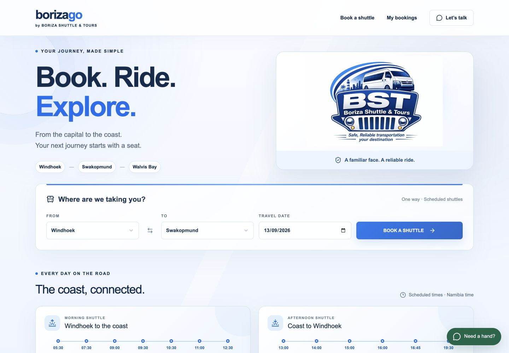
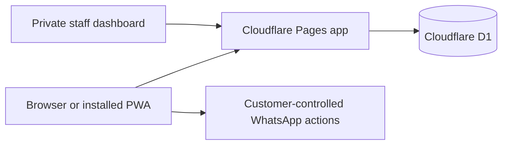

# Borizago — Book. Ride. Explore.

An installable shuttle-booking web app for **Boriza Shuttle & Tours** in Namibia.

[**Open the live app →**](https://borizashuttles.pages.dev/)

  

## The product

Borizago turns a WhatsApp-led booking process into a fast, guided journey that works in a browser and installs directly to a phone home screen. Customers can travel between Windhoek, Okahandja, Karibib, Usakos, Arandis, Swakopmund and Walvis Bay without downloading an app-store package.

The responsive website and installed progressive web app share one Cloudflare-hosted booking system, so seat counts, fares, schedules and payment state stay consistent everywhere.

## Customer journey

1. Choose the departure town, destination and date.
2. Select a published trip with live seat availability and passenger fares.
3. Add named Adult, Pensioner, Student and Child passengers.
4. Provide contact and pickup details, with a direct WhatsApp location hand-off.
5. Review the route, passengers, pickup, server-calculated total and cancellation policy.
6. Confirm the details and actively accept the Terms & Conditions, including luggage, safety and no-refund safeguards.
7. Choose EFT or office payment, confirm the booking and receive a unique reference.
8. Share the confirmation through WhatsApp and revisit it under **My bookings**.

The installed app detects standalone mode and removes its own install prompt. The booking flow uses a private first-party customer identifier, with no dependency on ChatGPT authentication or hosting.

## Support and travel resources

WhatsApp help is available throughout the journey at **+264 85 772 4329**, with **+264 81 731 4947** available for calls. The footer and home support panel also connect customers to [Boriza on Facebook](https://www.facebook.com/share/14qinXBbi7H/).

Customers can keep the [payment notice](https://borizashuttles.pages.dev/payment-notice.jpeg) and [bus-rules poster](https://borizashuttles.pages.dev/bus-rules.jpeg) on their phone. The booking flow explains EFT, wallet proof-of-payment and office payment, while the safety poster covers the practical onboard rules and luggage guidance.

The review screen requires two deliberate confirmations before submission: the customer verifies the passenger, contact and pickup details, then accepts the Terms & Conditions. The acceptance timestamp and terms version are recorded with the booking. The terms explain that customer cancellations are non-refundable because a released seat may remain vacant, subject to rights that cannot lawfully be excluded; if Boriza cancels or cannot provide the trip, the available remedy is handled according to the terms and applicable law. They also cover the supplied allowance of two medium bags or one big bag per passenger, extra luggage charges, valuables, prohibited items, pickup timing and passenger conduct.

## Timetable and route model

The public timetable reflects Boriza’s supplied operating times:

- Morning: Windhoek 05:30 → Okahandja 07:30 → Karibib 09:00 → Usakos 09:30 → Arandis 10:30 → Swakopmund 11:00 → Walvis Bay 12:30.
- Afternoon: Walvis Bay 13:00 → Swakopmund 14:00 → Arandis 15:00 → Usakos 16:00 → Karibib 16:45 → Windhoek 19:30.

The route engine expands these corridors into 36 valid town-to-town combinations while preventing reverse or identical-location selections. Every segment uses the same underlying vehicle record, so a seat booked from an intermediate stop still reduces the shared vehicle capacity.

## Operations dashboard

Boriza staff use a private, signed server session to manage the service. The dashboard can:

- create and edit routes and trips;
- change departure times, pickup points, vehicles, capacity and passenger fares;
- publish or hold trips;
- search bookings and customers;
- edit, confirm or cancel bookings;
- mark payments pending or paid;
- inspect passenger manifests and remaining seats.

No password is stored in the repository or browser bundle. Production credentials live in encrypted Cloudflare Pages secrets.

## Engineering

React, TypeScript and a server-side API run on Cloudflare Pages. Cloudflare D1 stores routes, trips and bookings. Booking creation validates the selected segment, recalculates the fare on the server and reserves capacity atomically. Idempotency keys prevent repeated taps from creating duplicate records, while revision checks reject stale trip and admin edits.

Payment-pending bookings consume seats. Cancellation releases them. The service worker provides a clear offline page but never caches booking records, admin responses or seat availability.

## Security and reliability

- Server-generated, HttpOnly and Secure session cookies.
- HMAC-signed staff sessions with a 12-hour lifetime.
- Constant-time password comparison and server-side email allowlist.
- Caller-supplied identity headers stripped at the Cloudflare edge.
- Server-owned totals and atomic capacity enforcement.
- No passenger data, credentials, banking details or database exports in this repository.
- Content-hashed frontend assets cached immutably; dynamic responses remain uncached.
- Mobile layouts verified at 390 px with no horizontal overflow.

## V1 boundaries

Tours, airport transfers, private transfers, parcels, live tracking, card payments and automatic messaging remain outside this release. The route, trip and booking structure leaves room to add them later without replacing the core system.

## Repository boundary

This public repository contains case-study material only. Application source is maintained in a private repository. Brand assets belong to Boriza Shuttle & Tours.
